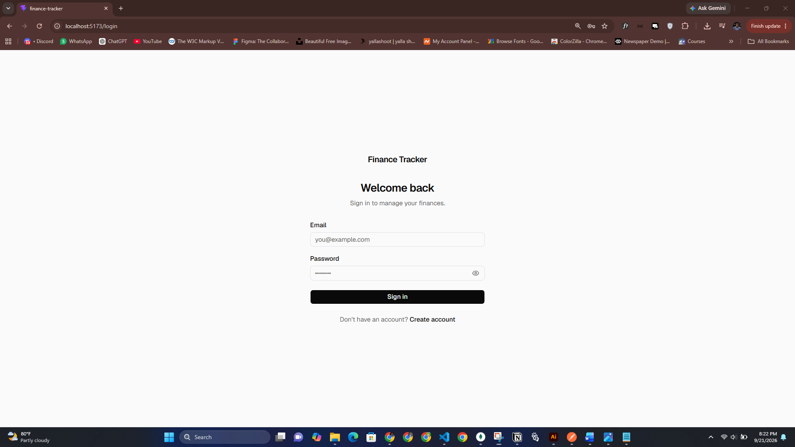
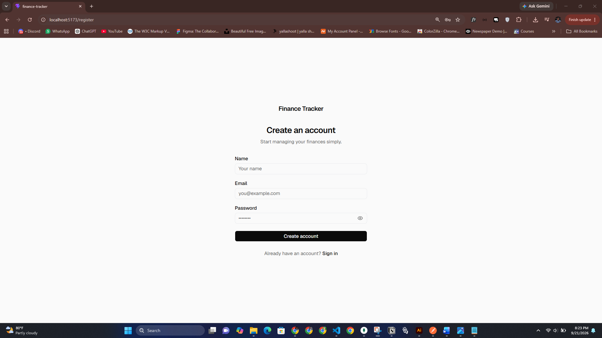
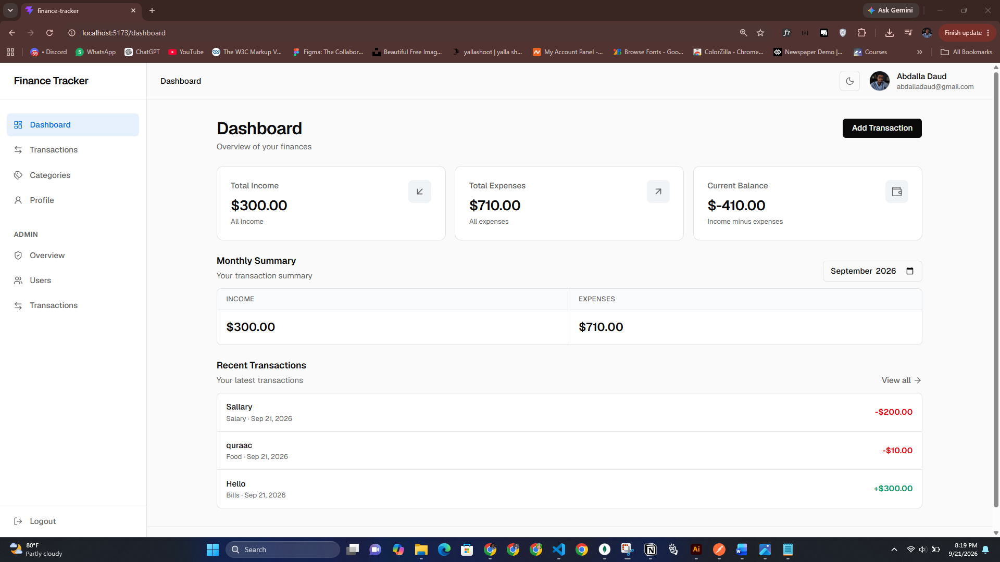
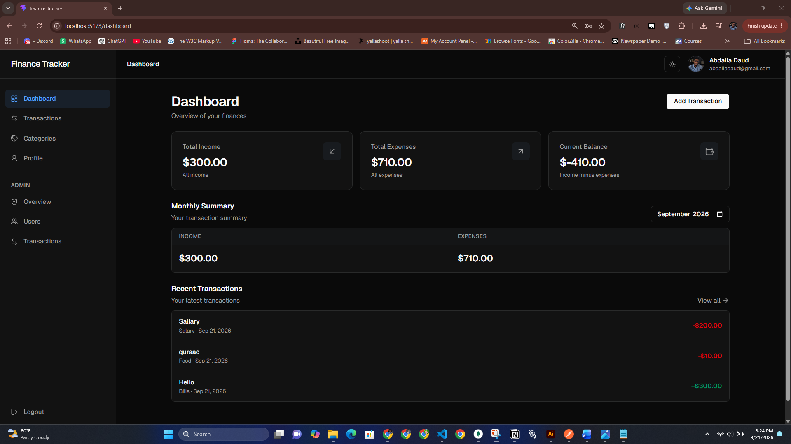
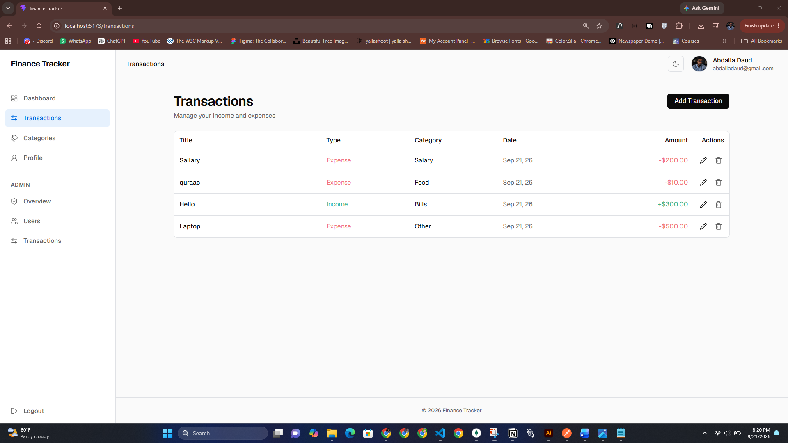
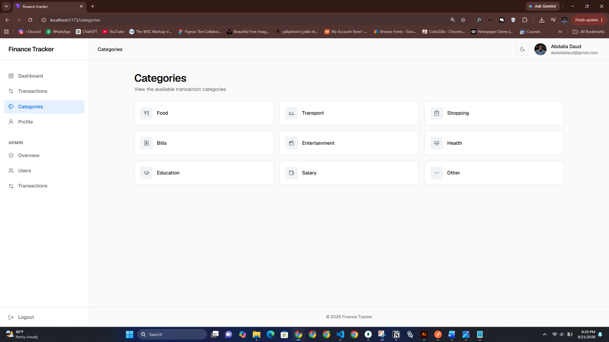
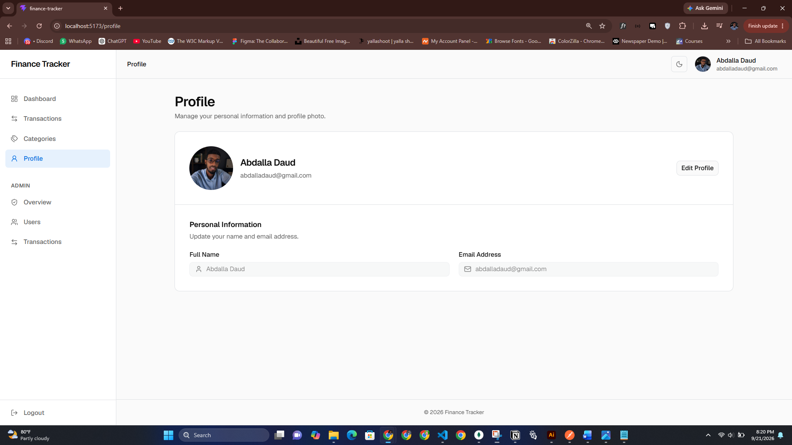
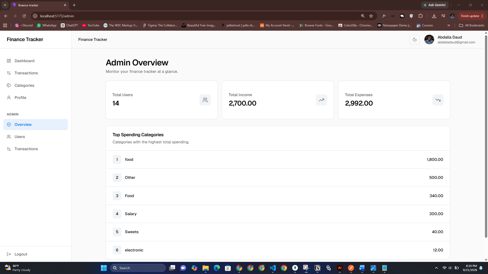
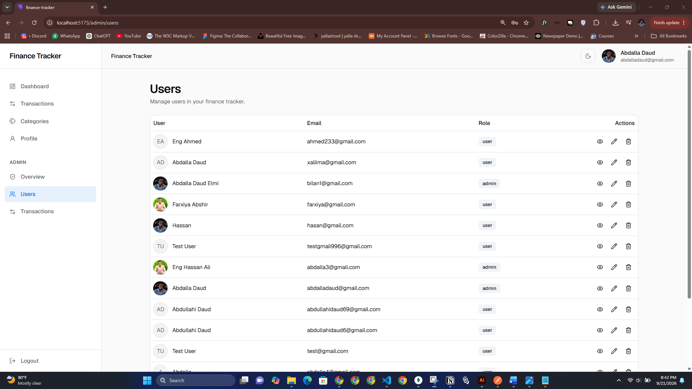
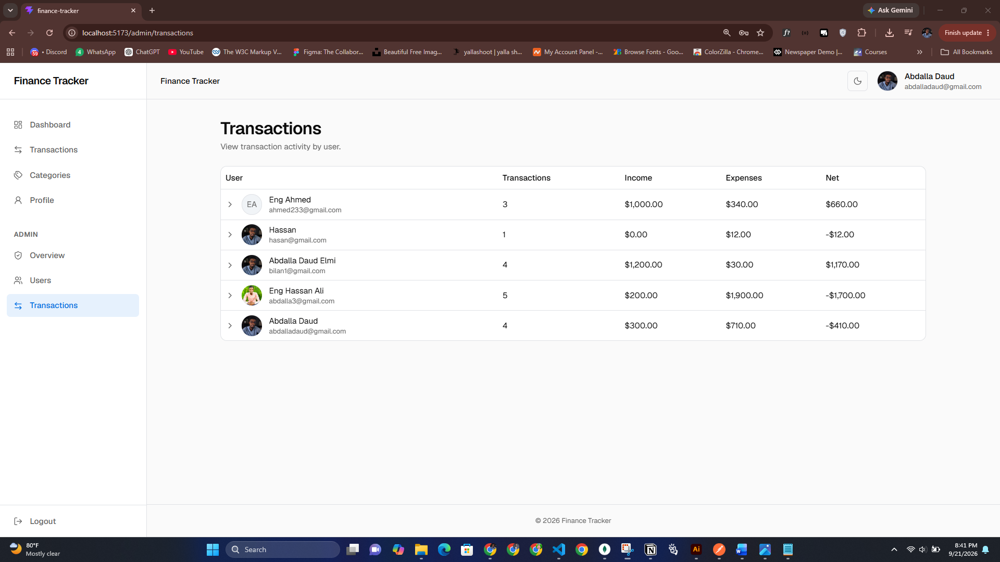

# Finance Tracker

A modern full-stack personal finance management application for tracking income, expenses, transactions, categories, and user profiles through a clean and responsive interface.

The project contains both the frontend and backend in a single repository.

## Features

- User registration and login
- JWT-based authentication
- Protected routes
- Email verification workflow
- Forgot/reset password workflow
- Dashboard with income, expenses, balance, and monthly summary
- Transaction management
- Transaction categories
- User profile management
- Profile image upload
- Light and dark theme support
- Responsive desktop and mobile UI
- Admin dashboard
- Admin user management
- Admin transaction overview
- User details, editing, and deletion
- Role-based admin access
- Expandable transaction activity by user
- Loading, empty, and error states
- Toast feedback and confirmation dialogs
- Custom 404 page

## Screenshots

### Authentication

| Login | Register |
| --- | --- |
|  |  |

### User Dashboard

### User Dashboard

| Light Mode | Dark Mode |
| --- | --- |
|  |  |

### Transactions



### Categories & Profile

| Categories | Profile |
| --- | --- |
|  |  |

### Admin

| Admin Overview | Admin Users |
| --- | --- |
|  |  |

### Admin Transactions

 

## Tech Stack

### Frontend

- React
- React Router
- Tailwind CSS
- shadcn/ui
- Lucide React
- TanStack React Query
- Zustand
- Axios
- Sonner

### Backend

- Node.js
- Express.js
- MongoDB
- Mongoose
- JWT
- bcryptjs
- Zod
- Multer
- Cloudinary
- Helmet
- CORS
- Express Rate Limit
- Swagger

## Project Structure

This is a full-stack application with both frontend and backend in the same repository.

```text
finance-tracker/
├── frontend/
│   ├── src/
│   ├── public/
│   └── package.json
│
├── backend/
│   ├── controllers/
│   ├── middlewares/
│   ├── models/
│   ├── routes/
│   ├── schemas/
│   ├── seeds/
│   ├── utilities/
│   ├── index.js
│   └── package.json
│
├── docs/
│   └── screenshots/
│
├── README.md
└── DOCUMENTATION.md
```

## Application Pages

### Public

- Login
- Register

### User

- Dashboard
- Transactions
- Categories
- Profile

### Admin

- Admin Overview
- Admin Users
- Admin Transactions

## Authentication

The application uses JWT-based authentication.

After successful login, the authenticated user receives a token that is used to access protected API endpoints.

User roles are:

- `user`
- `admin`

The same login flow is used for both roles. Admin access is determined by the authenticated user's role.

Frontend route protection improves the user experience, while backend authorization provides the actual security for admin endpoints.

## Admin Features

Administrators can:

- View overview statistics
- View total users
- View total income
- View total expenses
- View top spending categories
- View users
- View user details
- Copy a user ID
- Edit user information
- Change user roles
- Delete users
- View transaction activity grouped by user
- Expand a user to view individual transactions

## Frontend Architecture

The frontend is organized around reusable React components, pages, API modules, state management, and shared UI components.

```text
frontend/src/
├── components/
├── layouts/
├── lib/
├── pages/
├── routes/
├── utils/
└── ...
```

Key frontend responsibilities include:

- Page rendering
- Routing
- Authentication state
- API communication
- Server-state management
- Form handling
- Responsive UI
- Theme support
- Admin interface

## Backend Architecture

The backend provides the REST API used by the frontend.

```text
backend/
├── controllers/
├── middlewares/
├── models/
├── routes/
├── schemas/
├── seeds/
├── utilities/
└── index.js
```

The backend handles:

- Authentication
- User management
- Profile management
- Transactions
- Categories
- Admin operations
- Validation
- File uploads
- Security middleware
- Error handling
- API documentation

## API

The frontend communicates with the backend through REST API endpoints.

Main API areas include:

- Authentication
- User profile
- Transactions
- Categories
- Admin management

The backend also provides Swagger API documentation.

Production Swagger documentation:

https://finance-tracker-api-pdy4.onrender.com/docs

## Installation

### 1. Clone the repository

```bash
git clone <[your-github-repository-url](https://github.com/abdalladaud/finance-tracker)>
cd finance-tracker
```

### 2. Install frontend dependencies

```bash
cd frontend
npm install
```

### 3. Install backend dependencies

Open another terminal or return to the project root:

```bash
cd ../backend
npm install
```

### 4. Configure environment variables

Create the required `.env` files for the frontend and backend.

Do not commit secret values such as:

- JWT secrets
- Database credentials
- Cloudinary credentials
- Other private API keys

### 5. Run the backend

From the `backend` directory:

```bash
npm run dev
```

### 6. Run the frontend

From the `frontend` directory:

```bash
npm run dev
```

The frontend and backend run as separate applications during development but belong to the same full-stack project.

## Environment Variables

The exact environment variables depend on the frontend and backend configuration.

Typical backend configuration includes values for:

- MongoDB connection
- JWT secret
- Cloudinary
- CORS
- Server configuration

Frontend configuration includes the backend API base URL.

Keep all environment files containing secrets out of GitHub by using `.gitignore`.

## UI / UX

The application follows a clean and responsive interface with:

- Consistent spacing
- Reusable shadcn/ui components
- Neutral theme-aware colors
- Light and dark mode
- Responsive layouts
- Clear loading and error states
- Confirmation dialogs for destructive actions
- Toast notifications for user feedback
- Minimal interaction effects

## Responsive Design

The application is designed to work across:

- Desktop
- Tablet
- Mobile

Navigation, tables, forms, cards, dialogs, and page layouts adapt to different screen sizes.

## Documentation

For the complete technical documentation, see:

[Read the full documentation](DOCUMENTATION.md)

The documentation covers the application architecture, frontend structure, backend structure, authentication, admin features, API integration, state management, UI system, security model, data flows, and development workflow.

## Project Status

The Finance Tracker is a completed full-stack project containing both the frontend and backend in a single repository.

The project includes user authentication, financial transaction management, profile management, categories, admin functionality, responsive UI, and API integration.

## Author

**Abdalla Daud Elmi**
